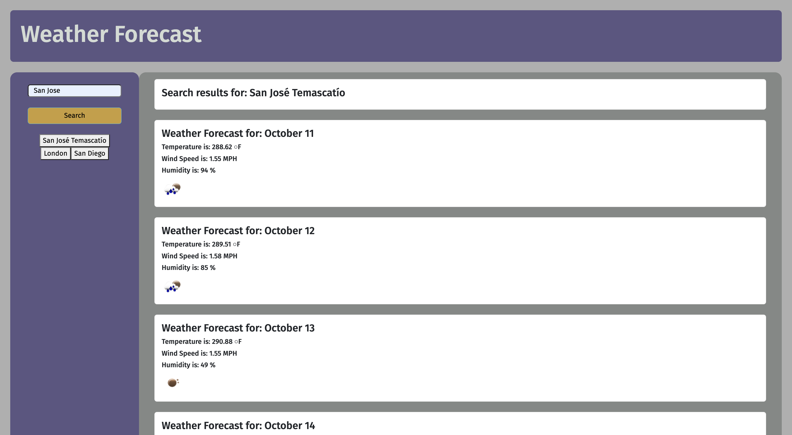

# WEB-API WEATHER WEBSITE

## DESCRIPTION
My Website allow user to access to the weather of a city. The website is using the API of [OpenWeatherMap](https://openweathermap.org/api) to get the weather of a city. The website is using the API of [OpenCage](https://opencagedata.com/api) to get the latitude and longitude of a city. The website is using the API of [Unsplash](https://unsplash.com/developers) to get a picture of a city. When the user enter a city, the website will display the weather of the city, the latitude and longitude of the city and a picture of the city. The website is using the API of [OpenWeatherMap](https://openweathermap.org/api) to get the weather of a city. The website is using the API of [OpenCage](https://opencagedata.com/api) to get the latitude and longitude of a city. The website is using the API of [Unsplash](https://unsplash.com/developers) to get a picture of a city. When the user enter a city, the website will display the weather of the city, the latitude and longitude of the city and a picture of the city.

## INSTALLATION
* Download the Zip file to your device
* Open file to zip local as needed
* Use your IDE to make update accordingly
* Update your repository and use accordingly

## USAGE
Upon opening the user will be presented with a search bar. The user will enter the city name and click on the search button. The website will display the weather of the city, the latitude and longitude of the city and a picture of the city. The website will also display the history of the city that the user has search for. The user can click on the history to display the weather of the city, the latitude and longitude of the city and a picture of the city.

## TECHNOLOGIES USED:
This project was built using a combination of the following technologies:

**JavaScript:** JavaScript is the core scripting language used to add interactivity and functionality to the web application. It allows for dynamic behavior, event handling, and manipulation of HTML elements.

**HTML** (Hypertext Markup Language): HTML is the standard markup language used to structure the content and layout of web pages. It provides the foundation for creating the user interface and defining the structure of the web application.

**CSS** (Cascading Style Sheets): CSS is used for styling and presentation. It determines the visual design, layout, and appearance of the web application, ensuring a visually appealing and responsive user interface.

**jQuery:** jQuery is a fast and concise JavaScript library that simplifies tasks like DOM manipulation, event handling, and AJAX interactions. It streamlines the process of working with HTML documents and enhances the efficiency of JavaScript code.

**Bootstrap:** Bootstrap is a popular front-end framework that provides pre-designed UI components, responsive grid systems, and CSS styling. It facilitates the creation of a consistent and visually pleasing user interface while ensuring compatibility across various devices and screen sizes.

*These technologies, when combined, enable the development of a dynamic, user-friendly, and visually appealing web application that provides an enhanced user experience.*